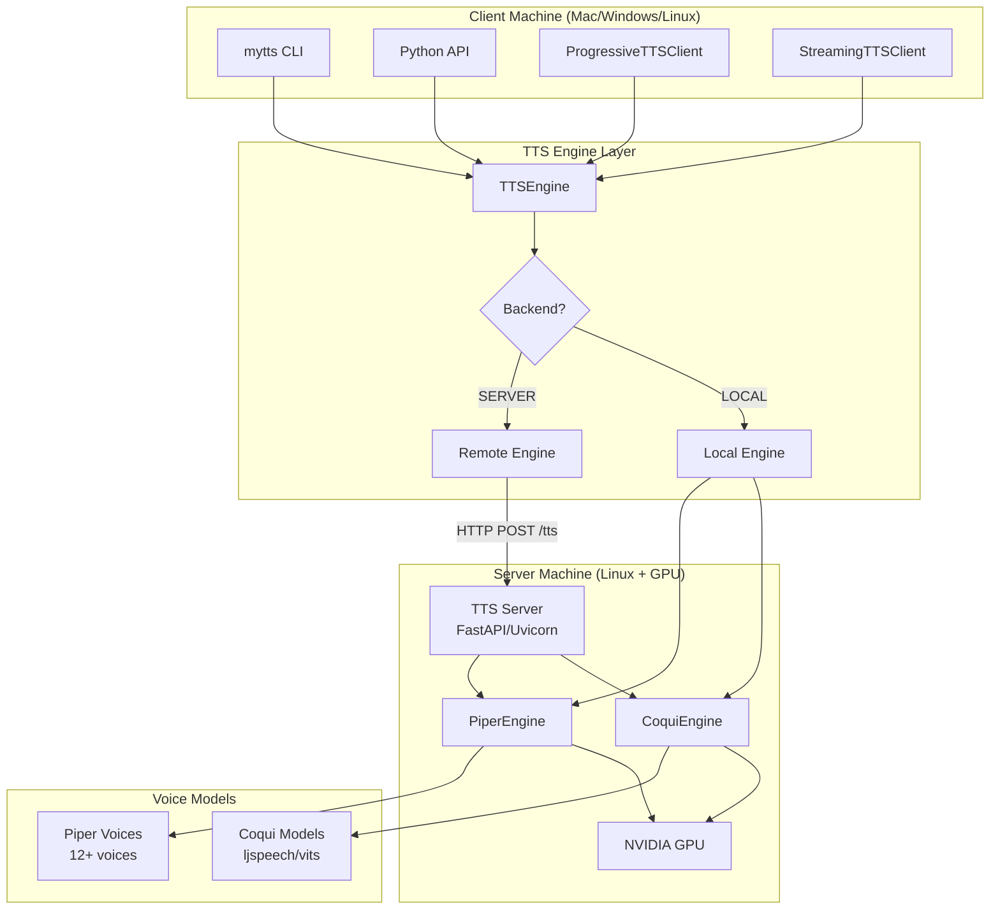
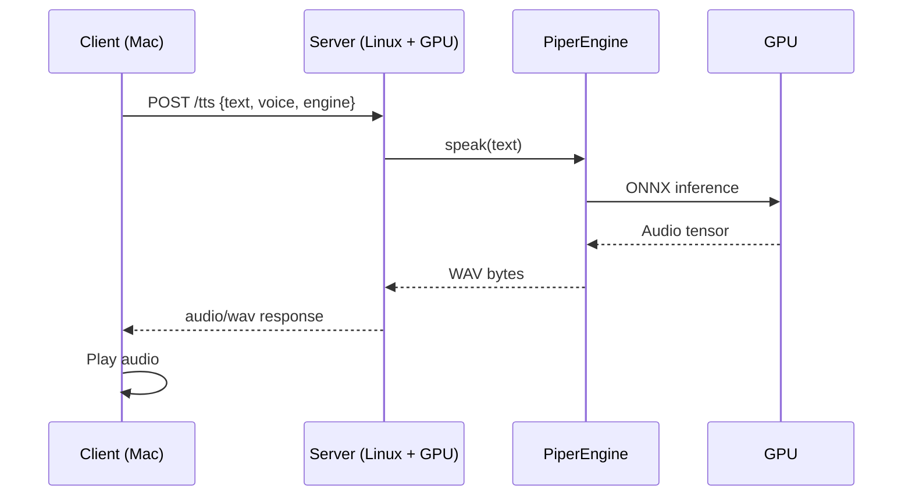
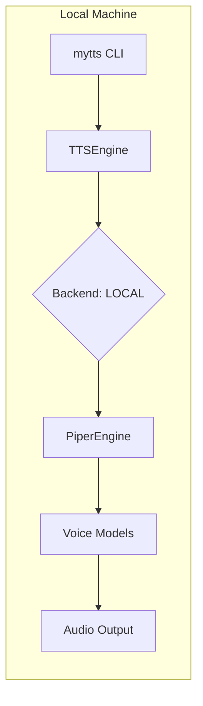
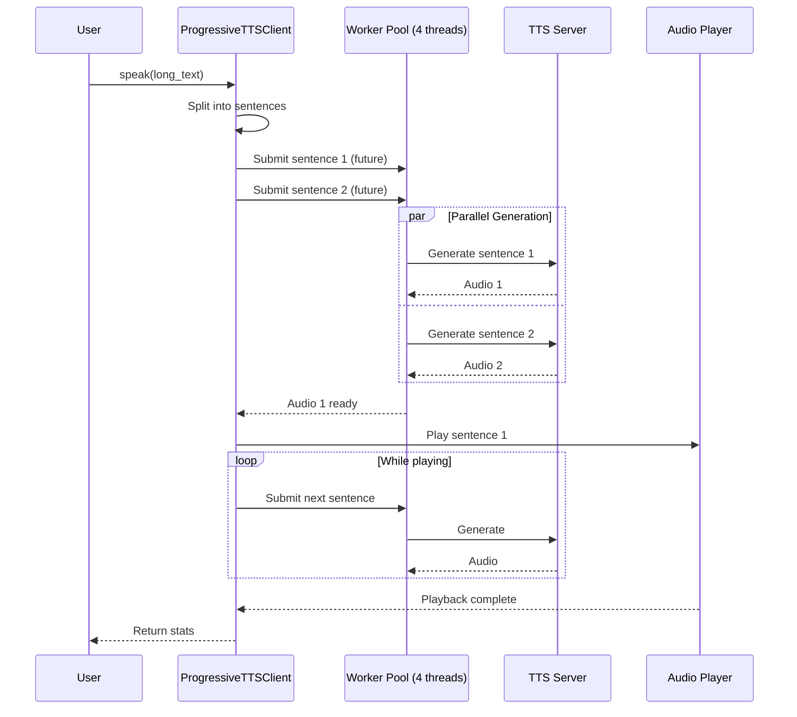
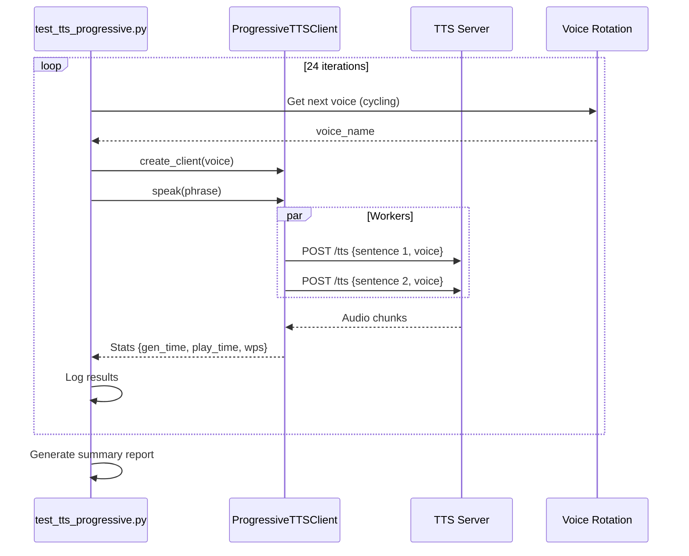

# myTTS

Self-hosted text-to-speech with client/server architecture for GPU offloading.

**Documentation:** [User Manual](docs/MANUAL.md) | [Server Guide](docs/SERVER_MVP.md) | [Build Guide](docs/BUILD.md)

## Architecture Overview



## Deployment Modes

### 1. Client/Server Mode (Recommended)

Offload TTS processing to a GPU server for best performance.



**Benefits:**
- GPU acceleration on server
- Low latency on client (no local processing)
- Multiple clients can share one GPU server
- 12+ voice variations available

### 2. Local Mode

Run TTS entirely on your local machine.



**Benefits:**
- No network dependency
- Works offline
- Simpler setup

**Limitations:**
- No GPU acceleration (CPU only)
- Slower than server mode

## Progressive TTS Flow

The `ProgressiveTTSClient` uses look-ahead processing for fluid playback:



## Benchmark Flow



## Quick Start

### Option A: Client/Server Mode (Recommended)

**Step 1: Server Setup (Linux with NVIDIA GPU)**

```bash
# On the server (e.g., 192.168.1.100)
git clone https://github.com/yourname/myTTS.git
cd myTTS

python3 -m venv venv
source venv/bin/activate
pip install -e .

# Install Piper (recommended for voice variety)
pip install piper-onnx onnxruntime-gpu

# Download voices
./scripts/download_voices.sh

# Start server
mytts serve --host 0.0.0.0 --port 8000
```

**Step 2: Client Setup (Your Mac/PC)**

```bash
# On your local machine
git clone https://github.com/yourname/myTTS.git
cd myTTS

python3 -m venv venv
source venv/bin/activate
pip install -e .

# Set server URL
export TTS_SERVER_URL=http://192.168.1.100:8000

# Read a file
mytts read document.txt --server

# Interactive chat
mytts chat --server

# Speak text
mytts speak "Hello world" --server
```

### Option B: Local Mode

```bash
# Install locally
python3 -m venv venv
source venv/bin/activate
pip install -e .
pip install piper-onnx

# Download at least one voice
mkdir -p ~/.local/share/piper/voices
cd ~/.local/share/piper/voices
wget https://huggingface.co/rhasspy/piper-voices/resolve/main/en/en_US/lessac/medium/en_US-lessac-medium.onnx
wget https://huggingface.co/rhasspy/piper-voices/resolve/main/en/en_US/lessac/medium/en_US-lessac-medium.onnx.json

# Use it
mytts read document.txt --engine piper
mytts speak "Hello world" --engine piper
```

## Available Voices

### Piper Voices (Recommended)

Piper provides the best voice variety and quality. All voices are available in different quality levels:

| Voice | Quality Levels | Gender | Description |
|-------|---------------|--------|-------------|
| **en_US-lessac** | medium, high, low | Neutral | Default voice, natural and clear |
| **en_US-amy** | medium, low | Female | Soft, friendly female voice |
| **en_US-norman** | medium | Male | Deep, professional male voice |
| **en_US-john** | medium | Male | Clear, articulate male voice |
| **en_US-danny** | low | Male | Casual, conversational male voice |
| **en_US-kathleen** | low | Female | Warm, gentle female voice |
| **en_US-ryan** | medium, high, low | Male | Versatile male voice |

**Quality Levels:**
- **medium** - Best balance of quality and speed (recommended)
- **high** - Highest quality, slower generation
- **low** - Fastest generation, lower audio quality

### Downloading Voices

```bash
# Download all voices
./scripts/download_voices.sh

# Or download specific voice
cd ~/.local/share/piper/voices
wget https://huggingface.co/rhasspy/piper-voices/resolve/main/en/en_US/lessac/medium/en_US-lessac-medium.onnx
wget https://huggingface.co/rhasspy/piper-voices/resolve/main/en/en_US/lessac/medium/en_US-lessac-medium.onnx.json
```

### Coqui Voices

Coqui TTS uses pre-trained models rather than voice files:

| Model | Description |
|-------|-------------|
| `tts_models/en/ljspeech/vits` | Default, stable VITS model |
| `tts_models/en/ljspeech/tacotron2-DDC` | Alternative Tacotron2 model |

**Note:** Coqui models don't support multiple voices - they produce a single voice per model. Use Piper for voice variation.

## TUI Mode

Interactive terminal UI for reading documents with real-time word highlighting.

```bash
# Start TUI with a document
mytts read document.txt --server --tui

# Resume from word position
mytts read document.txt --server --tui -w 1250
```

### Features

- **Word-Level Highlighting**: Current word highlighted in reverse video (subtitle-style sync)
- **Jump Dialog**: Press `j` to jump to any word or bookmark
- **Bookmarks**: Press `m` to set, `[`/`]` to navigate
- **Speed Control**: `+`/`-` to adjust, `0` to reset
- **Voice Selection**: Press `v` to cycle voices
- **Optimized for 96x30 terminal** (works from 80x24 to 150x40)

### Keyboard Controls

| Key | Action |
|-----|--------|
| `Space` | Pause/Resume |
| `↑`/`↓` | Navigate chunks |
| `Enter` | Jump to selected |
| `j` | Jump dialog |
| `+`/`-` | Speed control |
| `v` | Cycle voice |
| `r` | Repeat chunk |
| `m` | Set bookmark |
| `[`/`]` | Navigate bookmarks |
| `q` | Quit |

See [TUI Documentation](docs/TUI.md) for details.

## CLI Commands

| Command | Description | Example |
|---------|-------------|---------|
| `mytts read <file>` | Read text file aloud | `mytts read paper.txt --server` |
| `mytts speak <text>` | Speak text directly | `mytts speak "Hello" --server` |
| `mytts chat` | Interactive TTS chat | `mytts chat --server` |
| `mytts serve` | Start TTS server | `mytts serve --host 0.0.0.0` |
| `mytts ollama` | Chat with Ollama + TTS | `mytts ollama --model llama3.2` |

### CLI Options

```
--server          Use remote TTS server
--server-url URL  Server URL (default: http://localhost:8000)
--engine ENGINE   TTS engine: coqui or piper (default: piper)
--voice VOICE     Voice model (e.g., en_US-lessac-medium)
--workers N       Worker threads for progressive TTS (default: 4)
--buffer-size N   Sentences to pre-generate (default: 2)
```

## Python API

### Basic Usage

```python
from mytts import TTSEngine, TTSBackend

# Server mode
engine = TTSEngine(
    backend=TTSBackend.SERVER,
    server_url="http://192.168.1.100:8000",
    voice="en_US-lessac-medium"
)
engine.speak("Hello world!")

# Local mode
engine = TTSEngine(
    backend=TTSBackend.LOCAL,
    engine="piper",
    voice="en_US-amy-medium"
)
engine.speak("Hello world!")
```

### Progressive TTS (Look-ahead Processing)

```python
from mytts import TTSEngine, TTSBackend
from mytts.client import ProgressiveTTSClient

engine = TTSEngine(
    backend=TTSBackend.SERVER,
    server_url="http://192.168.1.100:8000"
)

client = ProgressiveTTSClient(
    engine,
    num_workers=4,      # Parallel generation threads
    buffer_size=2       # Sentences to pre-generate
)

# Speak with look-ahead - generates next sentences while playing current
stats = client.speak("Long text here. Multiple sentences. More content.")
print(f"Generated {stats['chunks_generated']} chunks")
print(f"WPS: {stats['total_generation_time'] / word_count}")

client.close()
```

### Streaming TTS (Real-time Feed)

```python
from mytts.client import StreamingTTSClient

client = StreamingTTSClient(engine, lookahead=2)
client.play()  # Start playback thread

# Feed text as it arrives (e.g., from LLM)
client.feed("First sentence.")
client.feed("Second sentence.")
client.feed("Third sentence.")

client.stop()
```

## Server Management

### Start/Stop Scripts

```bash
# On server: start_server.sh
cd /path/to/myTTS
source venv/bin/activate
nohup python -m mytts.server > server.log 2>&1 &
echo $! > server.pid

# On server: stop_server.sh
kill $(cat server.pid)

# On server: status_server.sh
curl -s http://localhost:8000/health | jq '.'
```

### Health Check

```bash
curl http://SERVER_IP:8000/health | jq '.'

# Response:
{
  "status": "ok",
  "engines": ["piper:en_US-lessac-medium:None"],
  "memory": {"total": 32000, "available": 16000, "percent": 50},
  "gpu": {"available": true, "memory_allocated": 500000000}
}
```

### Cleanup Resources

```bash
# Clear engine cache and GPU memory
curl -X POST http://SERVER_IP:8000/cleanup
```

## Benchmarks

Run the progressive TTS benchmark:

```bash
# Mock mode (no audio playback, just generation)
python test_tts_progressive.py --mock

# Full mode (with audio playback)
python test_tts_progressive.py

# Test specific voices
python test_voices_play.py --server
```

### Benchmark Output

```
Test | Words | Sent |   Time |   Gen |  Play |  Overlap |   WPS |                Voice
--------------------------------------------------------------------------------
   1 |     3 |    1 |  0.08s |  0.1s |  0.0s |    -100% |    39 |  en_US-lessac-medium
   2 |     4 |    1 |  0.09s |  0.1s |  0.0s |    -100% |    46 |    en_US-lessac-high
  ...
  24 |   366 |   18 |  4.18s |  7.3s |  0.0s |    -100% |    88 |       en_US-ryan-low
```

## Troubleshooting

### Server Errors (500 Internal Server Error)

**Symptom:** Client gets 500 errors intermittently.

**Cause:** Voice model not found on server.

**Solution:**
```bash
# Check installed voices
ssh server "ls ~/.local/share/piper/voices/*.onnx"

# Download missing voices
ssh server "cd /path/to/myTTS && ./scripts/download_voices.sh"
```

### Voice Not Found

**Symptom:** `RuntimeError: Voice model not found: /path/to/voice.onnx`

**Solution:**
```bash
# Download the voice
cd ~/.local/share/piper/voices
wget https://huggingface.co/rhasspy/piper-voices/resolve/main/en/en_US/lessac/medium/en_US-lessac-medium.onnx
wget https://huggingface.co/rhasspy/piper-voices/resolve/main/en/en_US/lessac/medium/en_US-lessac-medium.onnx.json
```

### GPU Not Detected

**Symptom:** Server runs in CPU mode despite having GPU.

**Solution:**
```bash
# Check CUDA
python -c "import torch; print(torch.cuda.is_available())"

# Install CUDA-enabled PyTorch
pip install torch torchvision torchaudio --index-url https://download.pytorch.org/whl/cu118
```

### Connection Refused

**Symptom:** `Connection refused` when connecting to server.

**Solution:**
```bash
# Check server is running
ssh server "curl localhost:8000/health"

# Check firewall
ssh server "sudo ufw allow 8000"

# Check server is bound to 0.0.0.0
ssh server "netstat -tlnp | grep 8000"
```

### Audio Not Playing

**Symptom:** No audio output on client.

**Solution:**
```bash
# Check audio device
python -c "import sounddevice; print(sounddevice.query_devices())"

# Set default device (macOS)
# System Preferences > Sound > Output
```

### Memory Issues

**Symptom:** Server becomes slow or crashes.

**Solution:**
```bash
# Clear engine cache
curl -X POST http://SERVER_IP:8000/cleanup

# Restart server
./stop_server.sh && ./start_server.sh

# Monitor GPU memory
nvidia-smi -l 1
```

## Project Structure

```
myTTS/
├── mytts/
│   ├── __init__.py          # TTSEngine, TTSMode, TTSBackend
│   ├── cli.py               # CLI commands (read, speak, serve, etc.)
│   ├── client.py            # ProgressiveTTSClient, StreamingTTSClient
│   ├── server.py            # FastAPI TTS server
│   ├── ollama.py            # Ollama chat integration
│   └── engine/
│       ├── __init__.py      # BaseEngine
│       ├── coqui.py         # Coqui TTS engine
│       ├── piper.py         # Piper ONNX engine
│       └── remote.py        # Remote server engine
├── test_tts_progressive.py  # Benchmark suite
├── test_voices.py           # Voice analysis tool
├── test_voices_play.py      # Voice playback test
├── start_server.sh          # Server start script
├── stop_server.sh           # Server stop script
└── status_server.sh         # Server status script
```

## Environment Variables

| Variable | Description | Default |
|----------|-------------|---------|
| `TTS_SERVER_URL` | TTS server URL | `http://localhost:8000` |
| `OLLAMA_URL` | Ollama server URL | `http://localhost:11434` |
| `CUDA_VISIBLE_DEVICES` | GPU device IDs | (all) |

## Acknowledgments

This project stands on the shoulders of giants. Many thanks to the open source community:

### Core TTS Engines

- **[Piper](https://github.com/rhasspy/piper)** by [Rhasspy](https://github.com/rhasspy) - Fast, local neural TTS with ONNX runtime. The voice models and synthesis engine that power the voice variation in this project.
- **[Coqui TTS](https://github.com/coqui-ai/TTS)** by [Coqui AI](https://coqui.ai/) - Deep learning toolkit for Text-to-Speech. High-quality neural TTS models with GPU support.

### Voice Models

- **[Piper Voices](https://huggingface.co/rhasspy/piper-voices)** - Collection of 12+ English voices (lessac, amy, norman, john, danny, kathleen, ryan, and more) hosted on Hugging Face.

### Infrastructure

- **[FastAPI](https://fastapi.tiangolo.com/)** by [Sebastián Ramírez](https://github.com/tiangolo) - Modern, fast web framework for building APIs with Python.
- **[Uvicorn](https://github.com/encode/uvicorn)** - Lightning-fast ASGI server implementation.
- **[PyTorch](https://pytorch.org/)** by Meta AI - Deep learning framework with CUDA GPU acceleration.
- **[ONNX Runtime](https://github.com/microsoft/onnxruntime)** by Microsoft - High-performance inference engine for ONNX models.

### Audio & CLI

- **[sounddevice](https://github.com/spatialaudio/python-sounddevice)** - PortAudio wrapper for audio playback and recording.
- **[NumPy](https://numpy.org/)** - Fundamental package for scientific computing and audio processing.
- **[Click](https://click.palletsprojects.com/)** by [Pallets](https://palletsprojects.com/) - Composable command line interface toolkit.

### AI Integration

- **[Ollama](https://ollama.ai/)** - Run large language models locally with simple API.

### Hosting

- **[Hugging Face](https://huggingface.co/)** - Model hosting and distribution platform.

---

If you find this project useful, please consider starring the repositories above. Open source is built by contributors like you.

## License

MIT
